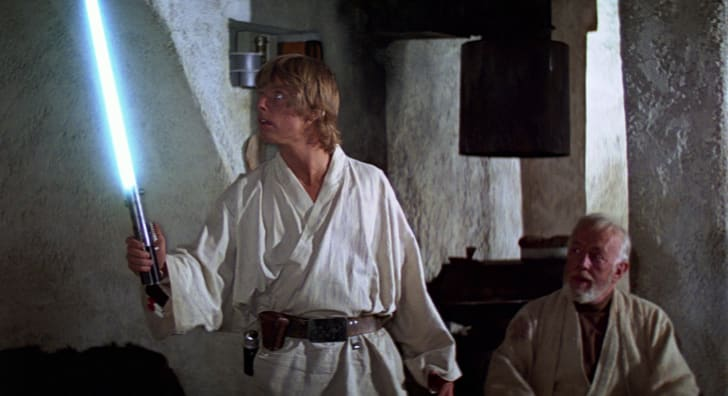
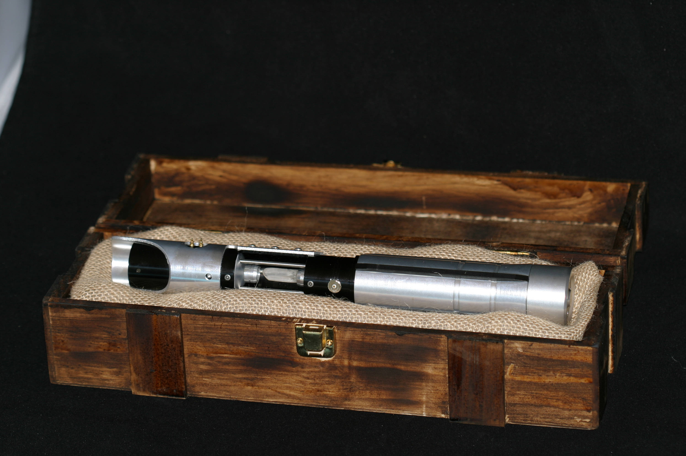

:100: Luke Skywalker's Lightsaber is an icon piece of film history.  It sold at auction in 2008 for $240,000.
Here is what a restoration on that kind of prop may look like.

### Unboxing

The lightsaber was made from the tube of an old Graflex camera handheld flash, and during filming a wooden pole was placed where the blade would be. The pole was doused in a special projection paint that made it easier for the post-production special effects team to add the colored glow of the weapon (more recent films have substituted CGI.)

It was sent to me in this nice wooden box and seems to have been well preserved.

### Movie Uses

The lightsaber used by Mark Hamill as Luke Skywalker in Star Wars: A New Hope (1977) and The Empire Strikes Back (1980) was sold in 2008 for $240,000

Mark Hamill does a good job acting with the prop as in reality it is nothing like shown in the movie.

### Progress Photos

